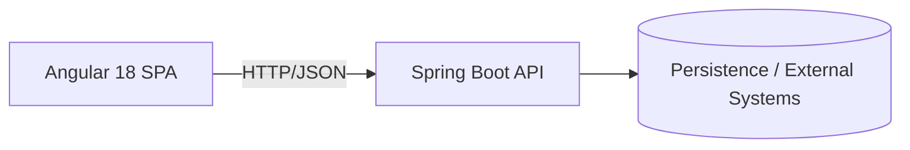

# Architecture Overview

## Target Architecture
- **Backend:** Spring Boot (Java 21) as API layer
- **Frontend:** Angular 18 SPA
- **Monorepo:** Backend in the root, frontend in `/frontend`
- **Persistence/Infra (Tests):** Testcontainers (e.g., PostgreSQL) for reproducible integration environments

## High-Level Diagram

## Principles
- **Clear API Contract**
- **Configurability** via `application.yml`
- **Testability first:** `@SpringBootTest` > `@WebMvcTest`
- **Automated Quality:** Unit/Integration Tests, Linting, CI
