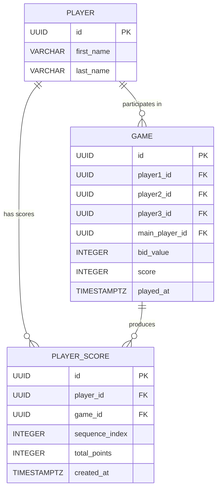

# Skat Game Entities (PostgreSQL 18)

## General Design Rules
- **Database:** PostgreSQL 18
- **Primary Key:** Each entity uses a `UUID` as the primary key (`id` column).
- **Timestamps:** All date and time values are stored as `OffsetDateTime`.
- **Index Naming Convention:** `<table>_<column>_IDX`
- **Unique Index Naming Convention:** `<table>_<column>_UNIQUE`
- **Constraint Naming Convention:** `<table>_<rule>_CHK` for check constraints and `<table>_<column>_NN` for not-null constraints.
- **Character Encoding:** UTF-8, maximum length constraints applied where specified.

---

## Entity: `player`
Represents a registered player participating in Skat games.

| Column | Type | Constraints | Description |
|--------|------|--------------|--------------|
| `id` | UUID | Primary Key | Unique player identifier |
| `first_name` | VARCHAR(50) | NOT NULL (`player_first_name_NN`) | Player’s first name |
| `last_name` | VARCHAR(50) | NOT NULL (`player_last_name_NN`) | Player’s last name |

### Indexes
- `player_first_name_IDX`
- `player_last_name_IDX`

first_name and last_name mut be unique together
### Unique Constraints
- `player_first_last_name_UQ` on (`first_name`, `last_name`)
---

## Entity: `game`
Represents a single Skat game session.

| Column | Type | Constraints | Description |
|--------|------|--------------|--------------|
| `id` | UUID | Primary Key | Unique game identifier |
| `player1_id` | UUID |  NULL (`game_player1_NN`), FK → `player(id)` | First player |
| `player2_id` | UUID |  NULL (`game_player2_NN`), FK → `player(id)` | Second player |
| `player3_id` | UUID |  NULL (`game_player3_NN`), FK → `player(id)` | Third player |
| `main_player_id` | UUID |  NULL (`game_main_player_NN`), FK → `player(id)` | Player who won the bidding |
| `bid_value` | INTEGER | CHECK (`game_bid_value_CHK`) | The final bid value |
| `score` | INTEGER | CHECK (`game_score_CHK`) | The points achieved by the main player |
| `played_at` | TIMESTAMP WITH TIME ZONE | NOT NULL (`game_played_at_NN`) | Date and time when the game was played |

Player might be null, if a player is deleted from the system

### Indexes
- `game_main_player_IDX`
- `game_played_at_IDX`

---

## Entity: `player_score`
Represents cumulative player scores over time.  
Each new game creates a new record for each player, forming a historical progression of player scores.

| Column | Type | Constraints | Description |
|--------|------|--------------|--------------|
| `id` | UUID | Primary Key | Unique record identifier |
| `player_id` | UUID |  NULL (`player_score_player_NN`), FK → `player(id)` | The player |
| `game_id` | UUID | NOT NULL (`player_score_game_NN`), FK → `game(id)` | Reference to the game that generated the score |
| `sequence_index` | INTEGER | NOT NULL (`player_score_sequence_NN`) | Incremental index per player for sorting |
| `total_points` | INTEGER | CHECK (`player_score_total_points_CHK`) | The cumulative score after the referenced game |
| `created_at` | TIMESTAMP WITH TIME ZONE | NOT NULL (`player_score_created_at_NN`) | Timestamp when the record was created |

player_id might be null, if a player is deleted from the system
constraint sequence_index must be greater or equal 0
ter or equal 0

### Indexes
- `player_score_player_IDX`
- `player_score_game_IDX`
- `player_score_sequence_IDX`

---

## Relationship Summary
- **player** ↔ **game**: Each game references three players plus one main player.
- **player_score** ↔ **game**: Each score record links to the game that generated it.
- **player_score** ↔ **player**: Each score record belongs to a specific player.

---

## Example ER Diagram (Conceptual)

