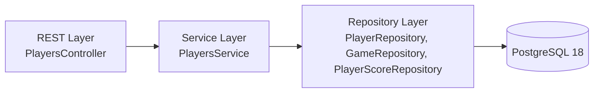

# DELETE `/api/players/{id}` — Specification (Draft)

Deletes a player by ID. Behavior depends on the `forceDeletion` parameter.

---

## 1. HTTP Contract

**Method**: `DELETE`  
**Path**: `/api/players/{id}`  
**Query Param**: `forceDeletion` *(optional, boolean, default=false)*  
**Content-Type**: `application/json` (response)

### Behavior
- If `forceDeletion = false`:  
  - The player **may only be deleted** if they **have not participated** in any game or player score.  
  - If the player has references in `game` or `player_score`, the request returns **409 Conflict**.  
- If `forceDeletion = true`:  
  - The player is **deleted unconditionally**.  
  - All foreign key references in `game` and `player_score` are **set to NULL** before deletion to prevent constraint violations.

### Example Requests

#### Safe delete
```http
DELETE /api/players/0c4c2f02-2d26-42ab-9d9b-0c1c1c7f5e38?forceDeletion=false
```

#### Forced delete
```http
DELETE /api/players/0c4c2f02-2d26-42ab-9d9b-0c1c1c7f5e38?forceDeletion=true
```

### Responses

#### 204 No Content
- Player successfully deleted (with or without force).

#### 404 Not Found
- Player with specified ID does not exist.

#### 409 Conflict
- `forceDeletion=false` and player is still referenced in `game` or `player_score`.

#### 400 Bad Request
- Invalid UUID format for `id`.

---

## 2. Layered Architecture



### 2.1 REST Layer (Controller)
Responsibilities:
- Parse `id` and `forceDeletion` (default `false`).  
- Validate UUID format.  
- Call `PlayersService.deletePlayer(id, forceDeletion)` and map exceptions to HTTP codes.

Example:
```java
@DeleteMapping("/api/players/{id}")
ResponseEntity<Void> deletePlayer(
  @PathVariable UUID id,
  @RequestParam(defaultValue = "false") boolean forceDeletion
);
```

### 2.2 Service Layer
Responsibilities:
- Fetch player by ID.  
- If not found → `NotFoundException` → 404.  
- If `forceDeletion=false`:  
  - Check if player is referenced in `game` (any of player1_id, player2_id, player3_id, main_player_id) or in `player_score`.  
  - If references exist → throw `ConflictException` → 409.  
  - Else delete the player.  
- If `forceDeletion=true`:  
  - Nullify references in related tables first, then delete the player.  

Example:
```java
public interface PlayersService {
  void deletePlayer(UUID id, boolean forceDeletion);
}
```

Pseudo logic:
```java
@Transactional
public void deletePlayer(UUID id, boolean forceDeletion) {
  PlayerEntity player = playerRepository.findById(id)
      .orElseThrow(() -> new NotFoundException("Player not found"));

  if (!forceDeletion) {
    boolean hasGames = gameRepository.existsByPlayer(id);
    boolean hasScores = playerScoreRepository.existsByPlayer(id);
    if (hasGames || hasScores) {
      throw new ConflictException("Player cannot be deleted while referenced");
    }
    playerRepository.delete(player);
    return;
  }

  // force deletion path
  gameRepository.nullifyReferencesToPlayer(id);
  playerScoreRepository.nullifyReferencesToPlayer(id);
  playerRepository.delete(player);
}
```

### 2.3 Repository Layer

**PlayerRepository**
```java
interface PlayerRepository extends JpaRepository<PlayerEntity, UUID> {}
```

**GameRepository**
```java
@Modifying
@Query("UPDATE GameEntity g SET g.player1 = NULL WHERE g.player1.id = :playerId")
void nullifyReferencesToPlayer(UUID playerId);

// Repeat for player2, player3, main_player
boolean existsByPlayer(UUID playerId);
```

**PlayerScoreRepository**
```java
@Modifying
@Query("UPDATE PlayerScoreEntity ps SET ps.player = NULL WHERE ps.player.id = :playerId")
void nullifyReferencesToPlayer(UUID playerId);

boolean existsByPlayer(UUID playerId);
```

---

## 3. Error Responses

| Code | Reason | Example |
|------|---------|----------|
| 204 | Deleted successfully | - |
| 404 | Player not found | `{ "error": "not_found", "message": "Player not found", "field": "id" }` |
| 409 | Player still referenced (force=false) | `{ "error": "conflict", "message": "Player is referenced in games or scores" }` |
| 400 | Invalid ID | `{ "error": "bad_request", "message": "Invalid player ID format" }` |

---

## 4. Validation Rules Summary

- `id` must be a valid `UUID`.  
- `forceDeletion` defaults to `false` if not specified.  
- Referential checks apply when `forceDeletion=false`.

---

## 5. Test Hints

- **force=false**: ensure `409` if player has games or scores.  
- **force=true**: ensure references in games and scores are nullified and player deleted.  
- **not found**: `404` for unknown UUID.  
- **invalid id**: `400` for malformed UUID.
