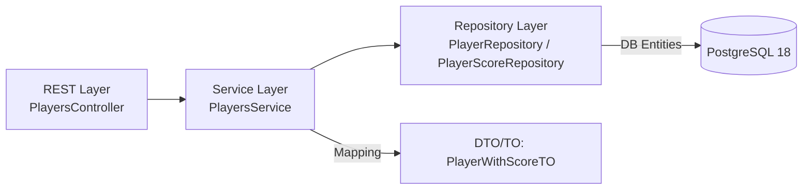

# GET `/api/players` — Specification (Draft)

This document specifies the **players listing endpoint** including parameters, validation, layering, and data contracts.

> **Purpose**: Return all players **with their current score snapshot** (latest cumulative points and sequence index).
> **Stability**: Draft — names and defaults may evolve.

---

## 1. HTTP Contract

**Method**: `GET`
**Path**: `/api/players`
**Content-Type**: `application/json` (response)

IMPORTANT: If a new player has no score in the system yet, `current_total_points` and `current_sequence_index` should be returned as `0`.

### Query Parameters
- `sort` *(optional, enum)* — allowed values:
  - `name` — sort by last name, then first name (ascending)
  - `score_desc` — sort by `current_total_points` (descending), then name
  *(Default: **name**)*
- `startIndex` *(optional, int ≥ 0)* — **zero-based** index of the first item to return. *(Default: 0)*
- `pageSize` *(optional, 1..200)* — max number of items to return. *(Default: 50)*

### Responses
- `200 OK`
  ```json
  {
    "items": [
      {
        "id": "UUID",
        "first_name": "string",
        "last_name": "string",
        "current_total_points": 123,
        "current_sequence_index": 7,
        "updated_at": "OffsetDateTime"
      }
    ],
    "paging": {
      "startIndex": 0,
      "pageSize": 50,
      "total": 1234
    },
    "sort": "name"
  }
  ```
- `400 Bad Request` — invalid parameters (see Validation).
  ```json
  {
    "error": "bad_request",
    "message": "Invalid query parameter: pageSize must be between 1 and 200",
    "field": "pageSize"
  }
  ```

---

## 2. Layered Architecture



### 2.1 REST Layer (Controller)
Responsibilities:
- Parse & validate query params (`sort`, `startIndex`, `pageSize`).
- Convert `sort` string to enum `PlayersSort` (reject unknown).
- Build a `PlayersQuery` (startIndex, pageSize, sort).
- Call `PlayersService.listPlayers(query)`.
- Return DTOs and paging metadata.

Suggested signatures:
```java
@GetMapping("/api/players")
ResponseEntity<PlayerListResponseTO> listPlayers(
    @RequestParam(name = "sort", required = false, defaultValue = "name") PlayersSort sort,
    @RequestParam(name = "startIndex", required = false, defaultValue = "0") @Min(0) int startIndex,
    @RequestParam(name = "pageSize", required = false, defaultValue = "50") @Min(1) @Max(200) int pageSize);
```

**Validation rules**:
- `sort` must be one of: `name`, `score_desc` → else `400`.
- `startIndex` ≥ 0 → else `400`.
- `pageSize` in `[1, 200]` → else `400`.

### 2.2 Service Layer
Responsibilities:
- Orchestrate repositories to fetch players & their **latest scores**.
- Apply sorting and pagination (prefer database-side ordering & windowing).
- Map **DB entities** → **transfer objects (TO/DTO)** for the REST response.
- Provide `total` count for pagination metadata.

Suggested signatures:
```java
public interface PlayersService {
    PlayerListResponseTO listPlayers(PlayersQuery query);
}

public record PlayersQuery(int startIndex, int pageSize, PlayersSort sort) {}
```

Mapping:
- `PlayerEntity` + latest `PlayerScoreEntity` → `PlayerWithScoreTO`
- Fallback `current_total_points = 0` and `current_sequence_index = 0` if no score exists.

### 2.3 Repository Layer (Spring Data)
Responsibilities:
- Efficiently load players and **their latest score** (by `sequence_index` or `created_at`).
- Expose a method returning the windowed result set and a separate `count(*)` for `total`.

Sketch (PostgreSQL 18, example approach):
```sql
-- Latest score per player using DISTINCT ON (requires suitable indexes)
SELECT p.id, p.first_name, p.last_name, ps.total_points, ps.sequence_index, ps.created_at
FROM player p
LEFT JOIN (
  SELECT DISTINCT ON (player_id)
         player_id, total_points, sequence_index, created_at
  FROM player_score
  ORDER BY player_id, sequence_index DESC
) ps ON ps.player_id = p.id
ORDER BY /* depends on sort */;
```

Spring Data example (pseudo):
```java
interface PlayerRepository extends Repository<PlayerEntity, UUID> {
  @Query(nativeQuery = true, value = """
    /* Window + ORDER BY depending on :sort */
  """)
  List<PlayerWithLatestScoreRow> findWindow(int offset, int limit, String sort);

  @Query("SELECT COUNT(p) FROM PlayerEntity p")
  long countAll();
}
```

> **Indexes** (examples):  
> - `player_last_name_IDX`, `player_first_name_IDX`  
> - `player_score_player_IDX`, `player_score_sequence_IDX`

---

## 3. Data Contracts (TO/DTO)

```java
public enum PlayersSort {
  NAME,        // last_name ASC, first_name ASC
  SCORE_DESC;  // current_total_points DESC, last_name ASC, first_name ASC
}
```

```java
public record PlayerWithScoreTO(
  UUID id,
  String first_name,
  String last_name,
  int current_total_points,
  int current_sequence_index,
  OffsetDateTime updated_at
) {}
```

```java
public record PlayerListResponseTO(
  List<PlayerWithScoreTO> items,
  PagingTO paging,
  PlayersSort sort
) {}

public record PagingTO(
  int startIndex,
  int pageSize,
  long total
) {}
```

---

## 4. Error Handling

- All validation errors: `400 Bad Request` with minimal problem shape.
- Unknown server errors: `500 Internal Server Error` (avoid leaking internals).
- Example:
```json
{
  "error": "bad_request",
  "message": "sort must be one of [name, score_desc]",
  "field": "sort"
}
```

---

## 5. Test Hints

- **REST Layer**: request parameter validation (invalid `sort`, negative `startIndex`, out-of-range `pageSize`).
- **Service Layer**: mapping correctness; behavior with/without scores; sort semantics.
- **Repository Layer**: latest-score selection correctness; paging boundaries; index usage.
