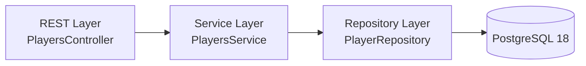

# Create or Update Player — Specification (Draft)

This document specifies how to **create or update a Player**. If an `id` is provided in the request, an **update** is attempted (only if the Player exists). If no `id` is provided, a **new Player** is created. Names must be unique per `(first_name, last_name)` pair.

> **Conventions**
> - **IDs:** `UUID`
> - **Names:** `first_name` and `last_name` are **required**, max length **50**, trimmed, non-blank
> - **Uniqueness:** `(first_name, last_name)` must be unique (case-insensitive suggested)
> - **Content-Type:** `application/json`

---

## 1. HTTP Contract

**Method**: `POST`  for create or PUT for update
**Path**: `/api/players/` (for create)  
**Path**: `/api/players/{id}`  (for update)
**Operation**: *Create or Update* depending on presence of `id` in the body.

### Request Body (upsert-style)
```json
{
  "first_name": "string (<=50, required)",
  "last_name": "string (<=50, required)"
}
```

### Responses

#### Create (no `id` provided)
- `201 Created`
  ```json
  {
    "id": "UUID",
    "first_name": "string",
    "last_name": "string"
  }
  ```
  Headers: `Location: /api/players/{id}`

- Errors
  - `400 Bad Request` — validation error (missing/blank/too long names)
  - `409 Conflict` — `(first_name, last_name)` already exists

#### Update (`id` provided)
- `200 OK`
  ```json
  {
    "id": "UUID",
    "first_name": "string",
    "last_name": "string"
  }
  ```

- Errors
  - `400 Bad Request` — invalid UUID / validation error
  - `404 Not Found` — player with given `id` does **not** exist
  - `409 Conflict` — update would violate uniqueness `(first_name, last_name)`

### Minimal Error Shape
```json
{
  "error": "conflict|bad_request|not_found",
  "message": "human readable message",
  "field": "optional field name(s)"
}
```

---

## 2. Layered Architecture



### 2.1 REST Layer (Controller)
Responsibilities:
- Parse JSON body; validate `first_name`, `last_name` (required, max 50, trimmed).
- If `id` present → attempt **update**; else → **create**.
- Map request to service command (`UpsertPlayerCommand`).
- Translate domain/service errors to HTTP codes (400/404/409).

Suggested signature:
```java
@PostMapping("/api/players")
ResponseEntity<PlayerTO> upsertPlayer(@RequestBody @Valid UpsertPlayerRequest body);
```

DTOs:
```java
public record UpsertPlayerRequest(
  UUID id,
  @NotBlank @Size(max = 50) String first_name,
  @NotBlank @Size(max = 50) String last_name
) {}
```

### 2.2 Service Layer
Responsibilities:
- **Create**: reject if a player with same `(first_name,last_name)` exists.
- **Update**: ensure `id` exists; reject if new `(first_name,last_name)` collides with another player.
- Perform mapping `PlayerEntity` ⇄ `PlayerTO`.
- Wrap in a single **transaction** to avoid race conditions.

Suggested API:
```java
public interface PlayersService {
  PlayerTO upsert(UpsertPlayerCommand cmd);
}

public record UpsertPlayerCommand(UUID id, String first_name, String last_name) {}
```

Transaction & uniqueness:
- Use repository existence checks:
  - `existsByFirstNameIgnoreCaseAndLastNameIgnoreCase(String f, String l)`
  - `existsByFirstNameIgnoreCaseAndLastNameIgnoreCaseAndIdNot(String f, String l, UUID id)`
- Create path:
  - if exists → throw `ConflictException("Player already exists")`
  - else save new entity
- Update path:
  - if not found by `id` → throw `NotFoundException("Player not found")`
  - if exists with different `id` → throw `ConflictException`
  - else update & save

### 2.3 Repository Layer (Spring Data)
Responsibilities:
- Provide standard CRUD + case-insensitive existence checks.

Example:
```java
public interface PlayerRepository extends JpaRepository<PlayerEntity, UUID> {
  boolean existsByFirstNameIgnoreCaseAndLastNameIgnoreCase(String firstName, String lastName);
  boolean existsByFirstNameIgnoreCaseAndLastNameIgnoreCaseAndIdNot(String firstName, String lastName, UUID id);
}
```

---

## 3. Data Contracts (TO/DTO)

```java
public record PlayerTO(
  UUID id,
  String first_name,
  String last_name
) {}
```

**Request → Service mapping**:
- Controller maps `UpsertPlayerRequest` to `UpsertPlayerCommand`.
- Service returns `PlayerTO` after persistence.

---

## 4. Validation Rules (Summary)

- `first_name` and `last_name`:
  - required, non-blank, trimmed, max 50 characters
- `id`:
  - if present → must be a valid `UUID` and **must exist** for updates
- Uniqueness:
  - `(first_name, last_name)` must be unique (suggest **case-insensitive** compare)

---

## 5. Examples

### Create
**Request**
```http
POST /api/players
Content-Type: application/json

{
  "first_name": "Anna",
  "last_name": "Schmidt"
}
```
**Response**
```http
HTTP/1.1 201 Created
Location: /api/players/0c4c2f02-2d26-42ab-9d9b-0c1c1c7f5e38
Content-Type: application/json

{
  "id": "0c4c2f02-2d26-42ab-9d9b-0c1c1c7f5e38",
  "first_name": "Anna",
  "last_name": "Schmidt"
}
```

### Update
**Request**
```http
POST /api/players
Content-Type: application/json

{
  "id": "0c4c2f02-2d26-42ab-9d9b-0c1c1c7f5e38",
  "first_name": "Anna",
  "last_name": "Mueller"
}
```
**Response**
```http
HTTP/1.1 200 OK
Content-Type: application/json

{
  "id": "0c4c2f02-2d26-42ab-9d9b-0c1c1c7f5e38",
  "first_name": "Anna",
  "last_name": "Mueller"
}
```

### Conflict (duplicate name on create)
```http
HTTP/1.1 409 Conflict
Content-Type: application/json

{
  "error": "conflict",
  "message": "Player with first_name+last_name already exists",
  "field": "first_name,last_name"
}
```

### Not found (update non-existing id)
```http
HTTP/1.1 404 Not Found
Content-Type: application/json

{
  "error": "not_found",
  "message": "Player not found",
  "field": "id"
}
```

---

## 6. Test Hints

- **REST**: body validation, missing fields, trimming, invalid UUID, response codes.  
- **Service**: create vs. update paths; uniqueness checks; transactional behavior.  
- **Repository**: case-insensitive existence checks; correct matching and exclusions.
